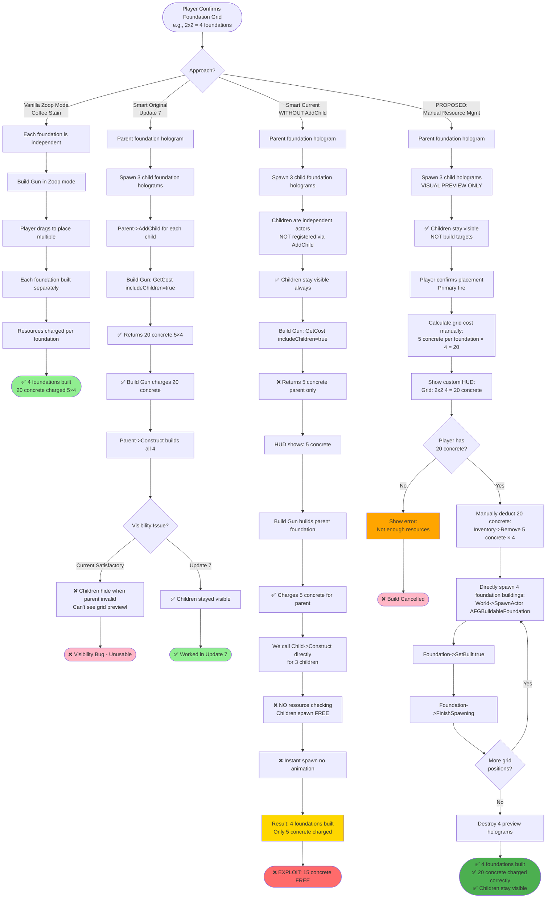

```mermaid

flowchart TD
    Start([Player Confirms Foundation Grid<br/>e.g., 2x2 = 4 foundations]) --> Vanilla{Approach?}
    
    %% Vanilla Zoop Path
    Vanilla -->|Vanilla Zoop Mode<br/>Coffee Stain| VanillaFlow[Each foundation is independent]
    VanillaFlow --> ZoopMode[Build Gun in Zoop mode]
    ZoopMode --> ZoopLoop[Player drags to place multiple]
    ZoopLoop --> IndependentBuilds[Each foundation built separately]
    IndependentBuilds --> EachCharge[Resources charged per foundation]
    EachCharge --> VanillaSuccess([✅ 4 foundations built<br/>20 concrete charged 5×4])
    
    %% Smart's Original Attempt (Update 7)
    Vanilla -->|Smart Original<br/>Update 7| SmartOld[Parent foundation hologram]
    SmartOld --> OldSpawn[Spawn 3 child foundation holograms]
    OldSpawn --> OldAddChild[Parent->AddChild for each child]
    OldAddChild --> OldGetCost[Build Gun: GetCost includeChildren=true]
    OldGetCost --> OldTotalCost[✅ Returns 20 concrete 5×4]
    OldTotalCost --> OldCharge[✅ Build Gun charges 20 concrete]
    OldCharge --> OldConstruct[Parent->Construct builds all 4]
    OldConstruct --> OldVisibility{Visibility Issue?}
    OldVisibility -->|Update 7| OldNoIssue[✅ Children stayed visible]
    OldVisibility -->|Current Satisfactory| OldIssue[❌ Children hide when parent invalid<br/>Can't see grid preview!]
    OldIssue --> OldFail([❌ Visibility Bug - Unusable])
    OldNoIssue --> OldSuccess([✅ Worked in Update 7])
    
    %% Smart's Current State (Broken)
    Vanilla -->|Smart Current<br/>WITHOUT AddChild| CurrentSmart[Parent foundation hologram]
    CurrentSmart --> CurrentSpawn[Spawn 3 child foundation holograms]
    CurrentSpawn --> NoAddChild[Children are independent actors<br/>NOT registered via AddChild]
    NoAddChild --> CurrentVisibility[✅ Children stay visible always]
    CurrentVisibility --> CurrentGetCost[Build Gun: GetCost includeChildren=true]
    CurrentGetCost --> OnlyParentCost[❌ Returns 5 concrete parent only]
    OnlyParentCost --> CurrentHUD[HUD shows: 5 concrete]
    CurrentHUD --> CurrentBuild[Build Gun builds parent foundation]
    CurrentBuild --> CurrentCharge[✅ Charges 5 concrete for parent]
    CurrentCharge --> OurManualBuild[We call Child->Construct directly<br/>for 3 children]
    OurManualBuild --> FreeBuildings[❌ NO resource checking<br/>Children spawn FREE]
    FreeBuildings --> InstantSpawn[❌ Instant spawn no animation]
    InstantSpawn --> CurrentResult[Result: 4 foundations built<br/>Only 5 concrete charged]
    CurrentResult --> CurrentFail([❌ EXPLOIT: 15 concrete FREE])
    
    %% Proposed Solution: Manual Management
    Vanilla -->|PROPOSED:<br/>Manual Resource Mgmt| ProposedStart[Parent foundation hologram]
    ProposedStart --> ProposedSpawn[Spawn 3 child holograms<br/>VISUAL PREVIEW ONLY]
    ProposedSpawn --> PreviewOnly[✅ Children stay visible<br/>NOT build targets]
    PreviewOnly --> PlayerConfirm[Player confirms placement<br/>Primary fire]
    PlayerConfirm --> CalcCost[Calculate grid cost manually:<br/>5 concrete per foundation × 4 = 20]
    CalcCost --> CustomHUD[Show custom HUD:<br/>Grid: 2x2 4 = 20 concrete]
    CustomHUD --> CheckInventory{Player has<br/>20 concrete?}
    CheckInventory -->|No| ShowError[Show error:<br/>Not enough resources]
    ShowError --> CancelBuild([❌ Build Cancelled])
    CheckInventory -->|Yes| ManualCharge[Manually deduct 20 concrete:<br/>Inventory->Remove 5 concrete × 4]
    ManualCharge --> DirectSpawn[Directly spawn 4 foundation buildings:<br/>World->SpawnActor AFGBuildableFoundation]
    DirectSpawn --> SetBuilt[Foundation->SetBuilt true]
    SetBuilt --> InitBuilding[Foundation->FinishSpawning]
    InitBuilding --> LoopCheck{More grid<br/>positions?}
    LoopCheck -->|Yes| DirectSpawn
    LoopCheck -->|No| CleanupHolograms[Destroy 4 preview holograms]
    CleanupHolograms --> ProposedSuccess([✅ 4 foundations built<br/>✅ 20 concrete charged correctly<br/>✅ Children stay visible])
    
    style VanillaSuccess fill:#90EE90
    style OldSuccess fill:#90EE90
    style OldFail fill:#FFB6C6
    style CurrentFail fill:#FF6B6B
    style ProposedSuccess fill:#4CAF50
    style ShowError fill:#FFA500
    style CancelBuild fill:#FFB6C6
    style CurrentResult fill:#FFD700
```